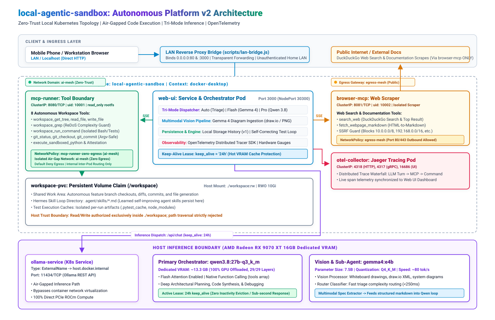

# local-agentic-sandbox

A full-stack, zero-trust autonomous AI coding platform. Orchestrates local LLMs via Ollama, Model Context Protocol (MCP), and hardened container sandboxes for safe autonomous code execution and web documentation retrieval.

---

## Architecture Overview

[](./docs/architecture.drawio.svg)
*Figure 1: Full-stack zero-trust architecture across Kubernetes namespace `local-agentic-sandbox`, air-gapped MCP execution boundary, and host GPU inference. Edit source: [docs/architecture.drawio](./docs/architecture.drawio).*

### Core Platform Capabilities
* **Tri-Mode Model Dispatcher (`[ ✨ Auto | ⚡ Flash | 🧠 Pro ]`)**: Clean segmented header control (zero prompt pills). Automatically classifies query complexity: fast triage & navigation on `gemma4:e4b` (~80 tok/s), deep architectural synthesis on `qwen3.8:27b-q3_k_m`.
* **Multimodal Architecture Ingestion Pipeline**: Ingests visual architecture diagrams, draw.io exports, whiteboard photos, and UI wireframes via `gemma4:e4b`, translating them into structured markdown system specifications for downstream code generation.
* **Autonomous Git & Workspace Developer Engine**: 8 native MCP tools (`workspace_get_tree`, `workspace_grep`, `workspace_read_file`, `workspace_write_file`, `workspace_run_command`, `git_status`, `git_checkout_branch`, `git_commit`) operating in `/workspace:rw` with automated test-and-repair loops until `exit_code == 0`.
* **Zero-Cold-Start VRAM Leases**: All inference queries automatically refresh a 24-hour model lease (`keep_alive: "24h"`), preventing Ollama from evicting models from the 16 GB GPU VRAM during idle periods.
* **Hardened Execution Boundary (`mcp-server`)**: Air-gapped on `ai-mesh` with unprivileged UID (`10001`), `read_only: true` rootfs, `cap_drop: ALL`, argv-safe git execution immune to shell injection, and ReDoS-guarded regex searching.
* **Isolated Browser Boundary (`browser-mcp`)**: Separate egress-enabled scraper on port 8081 (`uid: 10002`) with built-in SSRF protection (blocking RFC 1918 private subnets) to securely search DuckDuckGo and fetch documentation.
* **OpenTelemetry Distributed Tracing**: Full distributed span propagation from user turns down to tool invocations and shell execution, synchronized with a real-time Jaeger trace waterfall dashboard.
* **Session Chat Persistence**: Conversation history survives tab switches and page reloads via sanitized local storage (`local_agent_chat_history_v1`).

---

## Security Boundary Matrix

| Container / Pod | Placement | Filesystem | Linux Capabilities | User ID | Role & Network Isolation |
| :--- | :--- | :--- | :--- | :--- | :--- |
| **`mcp-runner`** | `local-agentic-sandbox` | `read_only: true` | `cap_drop: ALL` | `10001:10001` | Air-Gapped Code Execution (NetworkPolicy: Deny-All Egress except DNS + GitHub) |
| **`browser-mcp`** | `local-agentic-sandbox` | Read-Only App | Default (No Privs) | `10002:10002` | Isolated Web Documentation Scraper (NetworkPolicy: HTTP/HTTPS Egress Only) |
| **`web-ui`** | `local-agentic-sandbox` | Read-Write | Default | Non-Root | Next.js 15 Web Portal & Multi-MCP Dispatcher (Port 3000 / NodePort 30300) |
| **`otel-collector`**| `local-agentic-sandbox` | Ephemeral | Default (No Privs) | Non-Root | Distributed Jaeger Tracing Engine (Ports 4318, 4317, 16686) |
| **`ollama`** | Host Passthrough / PCIe | Local Drive | Host Native | Host User | Air-Gapped GPU Inference (AMD Radeon RX 9070 XT 16GB VRAM, ROCm, Port 11434) |

---

## Quickstart

You can manage the sandbox using either `make` or `npm`:

### 1. Ingest Model Weights
```bash
# Pull primary orchestrator model (qwen3.8:27b-q3_k_m)
make pull-primary
# OR: npm run pull:primary
```

### 2. Launch the Platform

#### Option A: Docker Compose
```bash
make up
# OR: npm run up
```

#### Option B: Kubernetes (Docker Desktop / Production)
All workloads reside in the `local-agentic-sandbox` namespace:
```bash
# Apply with Kustomize
kubectl apply -k deploy/k8s

# OR deploy with Helm
helm install local-agentic-sandbox deploy/helm/local-agentic-sandbox -n local-agentic-sandbox --create-namespace

# Verify all pods are running
kubectl get all -n local-agentic-sandbox
```

### 3. Run Automated Tests & Code Coverage
```bash
make test
# OR: npm test
```

### 4. Verify Security Hardening
```bash
make verify-sec
```

Once running, access the web interface at **`http://localhost:3000`**.

---

## Related Documentation

* [ARCHITECTURE.md](./ARCHITECTURE.md) - In-depth zero-trust topology and threat modeling.
* [DEVELOPMENT_SANDBOX.md](./docs/DEVELOPMENT_SANDBOX.md) - Guide for running inside isolated microVMs and development sandboxes.
* [ADR-001: Sandboxed MCP Architecture](./docs/ADR-001-sandboxed-mcp.md) - Architectural Decision Record for containerized MCP.

---

## LAN Bridge Security

The LAN reverse proxy bridge (`scripts/lan-bridge.js`) binds to `0.0.0.0` on ports `80` and `3000` without authentication. This is an **intentional design decision** by the system owner to allow seamless, frictionless access from mobile devices, tablets, and laptops across the private home local area network (e.g. `http://192.168.50.254/`) via simple browser bookmarks without token prompts.

### Blast Radius & Threat Model
* **Scope**: The bridge is not exposed to the public internet; exposure is strictly bounded to the local home network (e.g., family devices, guest Wi-Fi devices, or compromised IoT hardware on the same subnet).
* **Execution Capabilities**: Any unauthenticated client on the home LAN that connects to the Web UI can prompt the autonomous agent to invoke `workspace_run_command`, which executes arbitrary shell commands inside the sandboxed container workspace (`/workspace`).
* **Container Defenses**: Even with unauthenticated LAN access, execution is contained within an unprivileged UID (`10001`), root filesystem is mounted `read_only`, Linux capabilities are dropped (`cap_drop: ALL`), and egress network access from the code runner is blocked via network policies.

### Optional Hardening Path (Opt-In)
If authenticated access is ever desired in the future, the bridge can be hardened without breaking mobile usability:
1. **Environment-Driven Bearer Token**: Introduce an optional `BRIDGE_AUTH_TOKEN` environment variable.
2. **Bookmark Query Token**: Allow mobile bookmarks to authenticate seamlessly via URL query parameter (`http://192.168.50.254/?token=<SECRET_TOKEN>`), which the bridge extracts and converts into an HTTP-only session cookie.
3. **LAN Header Validation**: Reject any inbound LAN requests lacking the valid bearer token or session cookie with HTTP `401 Unauthorized`.

---

## Host-Filesystem Write Trust Boundary (`./workspace:rw`)

The `mcp-server` execution boundary mounts `./workspace` from the host directly into `/workspace:rw`:
* **Intentional Pair Programming Design**: Code written by the autonomous agent, git branches, test suites, diagrams, and learned skills are saved directly to `./workspace` on the host machine.
* **Blast Radius**: While the container root filesystem is `read_only` and path traversal outside `/workspace` is strictly rejected, any file placed inside `./workspace` can be read, written, or modified by the agent via `workspace_write_file` and `workspace_run_command`.
* **Security Guidance**:
  * Never create symlinks inside `./workspace` that point to sensitive host directories (such as `~/.ssh`, cloud credentials, or parent repositories).
  * Treat `./workspace` as an untrusted code sandbox that is monitored via version control. Git initializes an automatic repository with commit history inside `/workspace` to allow tracking and reverting agent-generated changes.


